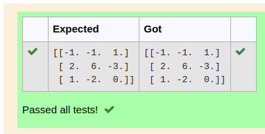

# INVERSE-OF-A-MATRIX
## Aim:
To write a python program to find the inverse of a matrix
## Equipment’s required:
1. 	Hardware – PCs
2. 	Anaconda – Python 3.7 Installation / Moodle-Code Runner
## Algorithm:
### Step 1:
Import the numpy module to use the built-in functions for calculation
### Step 2: 
Assign the lists in np.array()
### Step 3:
 Using the np.linalg.inv(A), we can find the inverse of the given matrix.
### Step 4: 
End the program.
## Program:
```
#Program to find the inverse of a matrix.
#Developed by: Akshayaa M
#RegisterNumber:22008405
import numpy as np
A=np.array([[6,2,3],[3,1,1],[10,3,4]])
sol=np.linalg.inv(A)
print(sol)
```

## Output:



## Result:
Thus the inverse of given matrix is successfully solved using python program

